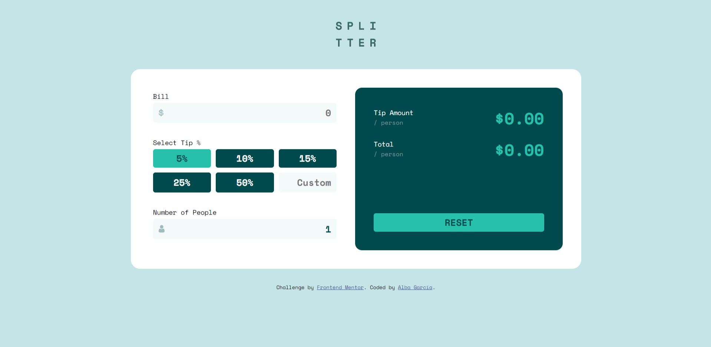

# Frontend Mentor - Tip calculator app solution

This is a solution to the [Tip calculator app challenge on Frontend Mentor](https://www.frontendmentor.io/challenges/tip-calculator-app-ugJNGbJUX). Frontend Mentor challenges help you improve your coding skills by building realistic projects.

## Table of contents

- [Overview](#overview)
  - [The challenge](#the-challenge)
  - [Screenshot](#screenshot)
  - [Links](#links)
- [My process](#my-process)
  - [Built with](#built-with)
  - [What I learned](#what-i-learned)
  - [Continued development](#continued-development)
  - [Useful resources](#useful-resources)
- [Author](#author)

## Overview

### The challenge

Users should be able to:

- View the optimal layout for the app depending on their device's screen size
- See hover states for all interactive elements on the page
- Calculate the correct tip and total cost of the bill per person

### Screenshot



### Links

- Solution URL: [Add solution URL here](https://your-solution-url.com)
- Live Site URL: [Tip Calculator App](https://tipcalculatorapp-albagr.netlify.app/)

## My process

### Built with

- CSS custom properties
- JavaScript
- Flexbox
- CSS Grid
- Mobile-first workflow
- BEM Naming Convention

### What I learned

This was quite a challenging project I must say, because I had to use forms a different way of what I'm used to (and I don't really use them that much either) so I had to do a bit of research to well... know what I was doing at least a bit. 

On the other hand, I got to use JavaScript which is always fun because I find myself researching how to do different things and I love when you make things work (eventhough maybe not in the best way.. yet). Like, for example, the .onkeydown().

At first I tried using it alone but everything was working so fast it didn't get the keys I just used, and later I leartn you can do a Timedown to fix it:

```js
document.querySelector(".d-grid__item--custom").onkeydown = function () {
  if (searchTimeout != undefined) clearTimeout(searchTimeout);
  searchTimeout = setTimeout(checkPercentage, 250);
};
```

And finally, but not less important, I'm trying to use BEM Naming Convention for my html id's and classes, which seemed easier than it is, because I'm still a bit confused on how to name some stuff, but I'm working on getting more confortable with it.

### Continued development

I'll still be trying to get better with the BEM Naming Convention and the Mobile-first workflow, which are pretty new to me, but I have to say I like them!

### Useful resources

- [W3schools](https://www.w3schools.com/) - Helping as always, when you don't know (or don't remember) how something works.
- [Stack Overflow - Determine when an user is typing](https://stackoverflow.com/questions/359887/determine-when-an-user-is-typing) - Thanks to this Stack Overflow thread I leartn about the timer, but .onkeypress() don't get the delete, space, etc. so...
- [Stack Overflow - JavaScript listener, "keypress" doesn't detect backspace?](https://stackoverflow.com/questions/4843472/javascript-listener-keypress-doesnt-detect-backspace) - In here I leartn about the existence of keydown and keyup.

## Author

- Website - [Alba García](https://koalba.netlify.app/)
- Frontend Mentor - [@koalba](https://www.frontendmentor.io/profile/koalba)
- ArtStation - [Alba García](https://www.artstation.com/koal_art)
- Instagram - [Koal_Art](https://www.instagram.com/koal_art/)
